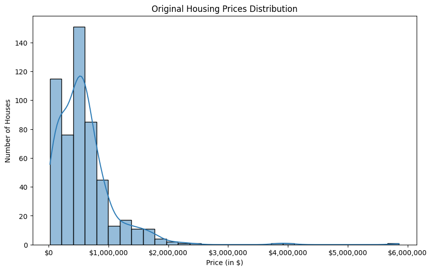
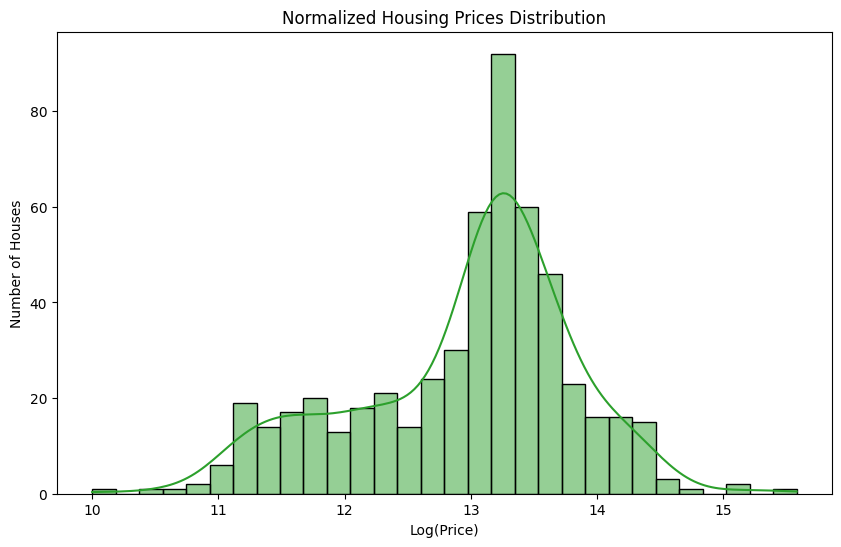
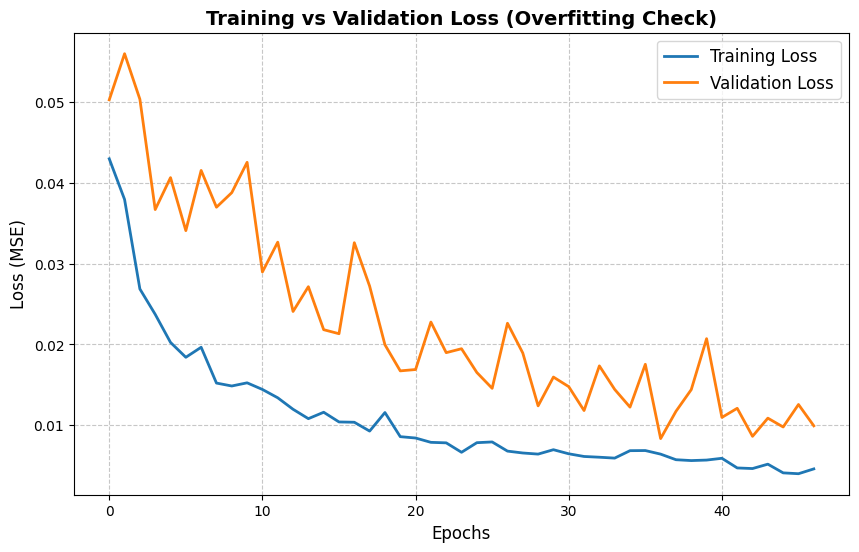

# PRODIGY_ML_Advance_internship_Task3

## 📌 Objective
The goal of this project is to build an advanced Multimodal Deep Learning Architecture using PyTorch and YOLOv8 to predict real estate prices by simultaneously analyzing visual data (house photos) and tabular data (bedrooms, bathrooms, area, and geographic location).

## 📊 Dataset & Preprocessing
**Source:** Houses Dataset (Kaggle)

**1. Original Data Distribution:**
Before processing, the target variable (Price) exhibited a massive right-skew, heavily favoring lower-priced homes with extreme outliers stretching into the multi-millions. Training on this raw distribution causes severe bias toward cheaper homes.

**2. Data Normalization:**
To stabilize the loss calculations and allow the model to learn proportional price differences, a Logarithmic Transformation (`np.log1p`) was applied to the prices, resulting in a normalized, balanced bell curve.

**3. Automated Preprocessing & Feature Engineering:**
To ensure clean data ingestion, custom scaling and encoding were applied:
* **Numeric Features** (`Bedrooms`, `Bathrooms`, `Area`): Processed using `StandardScaler`.
* **Geographic Features** (`Zipcode`): Processed using `OneHotEncoder` (via `pd.get_dummies`) to give the model critical neighborhood intelligence.
* **Images:** Processed using PyTorch `transforms` (Resized to 128x128, converted to Tensors, and RGB normalized).

## 🧠 Methodology & Approach
* **Baseline Model Evaluation:** An initial standard Convolutional Neural Network (CNN) combined with an MLP struggled to extract meaningful features from the small dataset, hitting a hard accuracy ceiling of 31.8% and a Validation Loss of ~0.0247.
* **Advanced Transfer Learning (YOLOv8):** We pivoted to a state-of-the-art dual-input architecture. We stripped the classification head from `YOLOv8-Nano` to act as a pure visual feature extractor, pulling 1280 highly compressed features from every house image.
* **Multimodal Fusion:** The YOLO visual features were concatenated with the processed tabular features and passed through a custom Fusion Center utilizing `BatchNorm1d` and `Dropout (0.3)` to output the final predicted price.

## 📉 Overfitting Check
To ensure the model was generalizing well on such a small dataset, rigorous Early Stopping (Patience = 10) was implemented. The convergence of the training and validation loss curves confirms the model learned underlying market patterns without memorizing the data, safely triggering a stop at Epoch 47.

## 📈 Key Results & Insights
* **Final Accuracy:** 91.6% (Predictions falling strictly within a 15% margin of the actual market price).
* **Final Validation Loss:** 0.0099 (Demonstrating highly stable convergence and excellent generalization).
* **Insight:** Utilizing pre-trained state-of-the-art computer vision models (like YOLO) for feature extraction vastly outperforms custom CNNs built from scratch on small-scale, highly subjective datasets like real estate.

## 📦 Model Access & Deployment
The fully trained multimodal neural network weights have been exported using PyTorch. 

The complete model is available directly in this repository as `yolov8_final_multimodal_housing.pth`. It can be loaded alongside the defined PyTorch architecture for immediate multimodal price predictions on new image/tabular data pairs.

## 🛠️ Tech Stack
* **Language:** Python
* **Libraries:** PyTorch, Ultralytics (YOLOv8), Scikit-learn, Pandas, NumPy, KaggleHub, Matplotlib, Seaborn

## 👩‍💻 Author
**Eshaal Hammad**
* **Email:** eshaalhammad234@gmail.com
